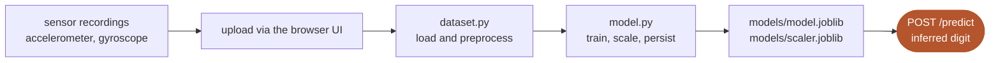

# PIN Sensor Side-Channel Prediction Webapp

A web application for training and deploying machine learning models that analyse
side-channel sensor data, such as accelerometer and gyroscope readings, to predict PIN
input.

Builds on prior research into side-channel attacks using motion sensors, notably
[matteonerini/pin-side-channel-attacks](https://github.com/matteonerini/pin-side-channel-attacks).

## How it works



## Research context

This tool is intended for research, educational and experimental purposes only. The
effectiveness of side-channel PIN inference depends on sensor quality, device hardware,
user behaviour and environmental noise, so real-world applicability varies significantly.

## Requirements

- Python 3.7 or newer
- FastAPI, uvicorn, numpy, pandas, scikit-learn, joblib, python-multipart
  (all in `pin-side-channel/backend/requirements.txt`)

## Installation

```bash
git clone https://github.com/Elnimo-00/Pin-sensor-prediction-webapp.git
cd Pin-sensor-prediction-webapp
```

Create and activate a virtual environment.

On macOS or Linux:

```bash
python3 -m venv venv
source venv/bin/activate
```

On Windows (PowerShell):

```powershell
python -m venv venv
venv\Scripts\Activate.ps1
```

Install the dependencies:

```bash
pip install -r pin-side-channel/backend/requirements.txt
```

## Usage

Start the API from the backend directory:

```bash
cd pin-side-channel/backend
uvicorn main:app --reload
```

The API listens on `http://127.0.0.1:8000`. Open `pin-side-channel/index.html` in a
browser to use the interface against it.

| Endpoint | Method | Description |
| --- | --- | --- |
| `/train` | POST | Upload a sensor dataset and train a model |
| `/predict` | POST | Return the inferred digit for a sensor sample |

## Project structure

```
pin-side-channel/
├── index.html                  # browser UI
└── backend/
    ├── main.py                 # FastAPI app, /train and /predict
    ├── dataset.py              # loading and preprocessing
    ├── model.py                # training and inference
    ├── models/                 # persisted model.joblib and scaler.joblib
    └── requirements.txt
```

## Notes

The repository is under active development; contributions and feedback are welcome.
